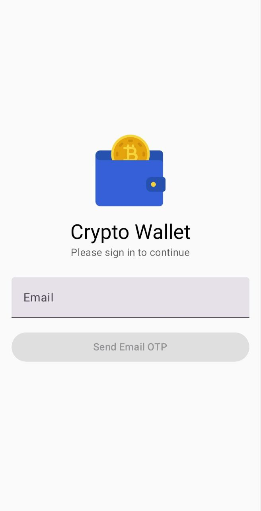
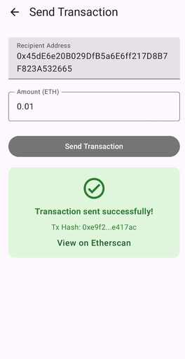

# Crypto Wallet App

A simple crypto wallet app using **Dynamic SDK**, with email OTP login, wallet verification, and sending Ethereum transactions.

## Architecture

* **Login:** Email OTP authentication
* **Wallet:** Connect via Dynamic SDK, fetch balance, send transactions
* **UI:** Jetpack Compose screens:

    1. Login & OTP verification
    2. Wallet details (balance, network, address)
    3. Send transaction
* **State Management:** ViewModel + StateFlow
* **Blockchain:** Ethereum Sepolia testnet

## How to Run

1. Clone the repository:

```
git clone https://github.com/YOUR_USERNAME/YOUR_REPO.git
cd YOUR_REPO
```

2. Open the project in Android Studio (Arctic Fox or newer recommended)
3. Let Gradle sync and build the project
4. Connect a physical device or start an emulator
5. Run the app
6. Login using your email OTP and start using the wallet features

## Screenshots

* **Login & OTP Verification:** 
* **Wallet Details:** 
* **Send Transaction:** 

## Assumptions

* Users have a valid email
* Only Ethereum Sepolia testnet supported
* Internet connection required for wallet actions
